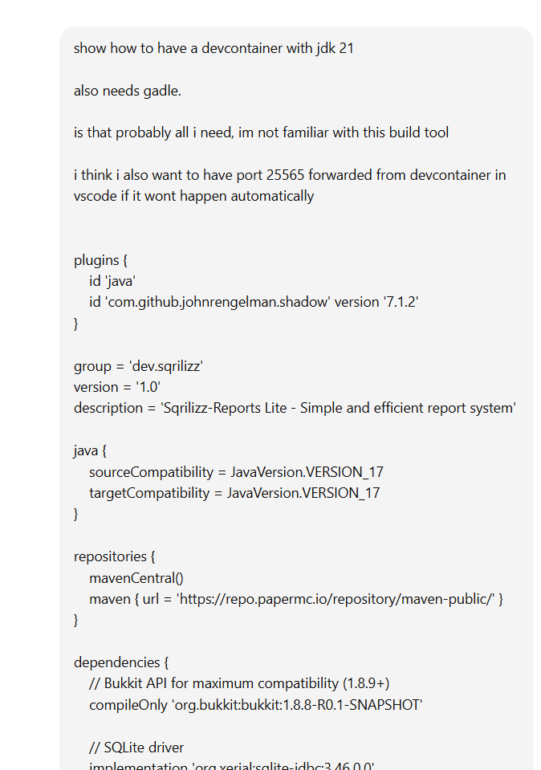
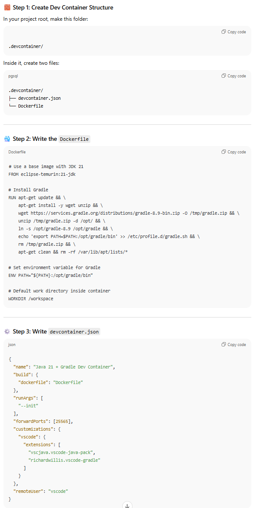
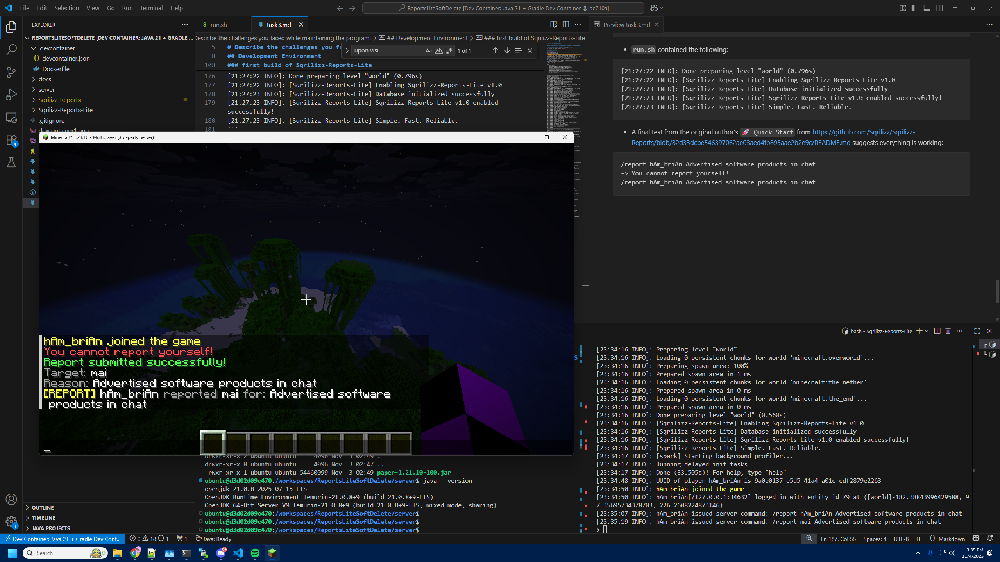

# Determine the type of maintenance.

# Describe what maintenance-related activities you performed/did not perform (like testing/ regression testing). Describe the reason why an activity was not performed.  

# Describe the challenges you faced while maintaining the program. 
The rest of this document describes all the activities after `identifying the software and goals` 

## Setting Up Development Environment
This section covers building the plugin so I can produce a vanilla copy as the author distributes while having supporting tooling so I can make changes later. 
### dev container
- I queried ChatGPT   


- Upon visiting https://hub.docker.com/_/eclipse-temurin I found the correct label to extend from.
- `remoteUser` was causing issues so I queried ChatGPT and followed their recommendation to use `root` rather than `vscode`. The container ran but this is poor practice. Since I had root access in the container a simple execution of `ls -la` showed some files owned by a user `ubuntu` who I plugged into the field.  

### minecraft server
- I got the executable and most of the flags for a start script from https://fill-ui.papermc.io/projects/paper/version/1.21.10

- Here's my `run.sh`:
```
java \
    -Xms2G -Xmx2G \
    -XX:+AlwaysPreTouch -XX:+DisableExplicitGC -XX:+ParallelRefProcEnabled -XX:+PerfDisableSharedMem -XX:+UnlockExperimentalVMOptions \
    -XX:+UseG1GC -XX:G1HeapRegionSize=8M -XX:G1HeapWastePercent=5 -XX:G1MaxNewSizePercent=40 -XX:G1MixedGCCountTarget=4 -XX:G1MixedGCLiveThresholdPercent=90 \
    -XX:G1NewSizePercent=30 -XX:G1RSetUpdatingPauseTimePercent=5 -XX:G1ReservePercent=20 -XX:InitiatingHeapOccupancyPercent=15 -XX:MaxGCPauseMillis=200 -XX:MaxTenuringThreshold=1 -XX:SurvivorRatio=32 \
    -jar paper-1.21.10-100.jar
``` 

```
ubuntu@d3d02d09c470:/workspaces/ReportsLiteSoftDelete/server$ ./run.sh 
Downloading mojang_1.21.10.jar
Applying patches
Starting org.bukkit.craftbukkit.Main
[03:07:55 INFO]: [bootstrap] Running Java 21 (OpenJDK 64-Bit Server VM 21.0.8+9-LTS; Eclipse Adoptium Temurin-21.0.8+9) on Linux 6.1.0-35-amd64 (amd64)
[03:07:55 INFO]: [bootstrap] Loading Paper 1.21.10-100-main@e8c6ba5 (2025-11-01T22:04:43Z) for Minecraft 1.21.10
[03:07:55 INFO]: [PluginInitializerManager] Initializing plugins...
[03:07:55 INFO]: [PluginInitializerManager] Initialized 0 plugins
[03:07:55 INFO]: [ReobfServer] Remapping server...
[03:08:04 WARN]: Failed to load eula.txt
[03:08:04 INFO]: You need to agree to the EULA in order to run the server. Go to eula.txt for more info.
[03:08:06 INFO]: [ReobfServer] Done remapping server in 10073ms.
ubuntu@d3d02d09c470:/workspaces/ReportsLiteSoftDelete/server$ ./run.sh 
Starting org.bukkit.craftbukkit.Main
[03:08:23 INFO]: [bootstrap] Running Java 21 (OpenJDK 64-Bit Server VM 21.0.8+9-LTS; Eclipse Adoptium Temurin-21.0.8+9) on Linux 6.1.0-35-amd64 (amd64)
[03:08:23 INFO]: [bootstrap] Loading Paper 1.21.10-100-main@e8c6ba5 (2025-11-01T22:04:43Z) for Minecraft 1.21.10
[03:08:23 INFO]: [PluginInitializerManager] Initializing plugins...
[03:08:24 INFO]: [PluginInitializerManager] Initialized 0 plugins
[03:08:32 INFO]: Environment: Environment[sessionHost=https://sessionserver.mojang.com, servicesHost=https://api.minecraftservices.com, profilesHost=https://api.mojang.com, name=PROD]
[03:08:32 INFO]: Found new data pack file/bukkit, loading it automatically
[03:08:32 INFO]: Found new data pack paper, loading it automatically
[03:08:33 INFO]: No existing world data, creating new world
[03:08:34 INFO]: Loaded 1461 recipes
[03:08:34 INFO]: Loaded 1574 advancements
[03:08:34 INFO]: [ca.spottedleaf.dataconverter.minecraft.datatypes.MCTypeRegistry] Initialising converters for DataConverter...
[03:08:35 INFO]: [ca.spottedleaf.dataconverter.minecraft.datatypes.MCTypeRegistry] Finished initialising converters for DataConverter in 595.0ms
[03:08:35 INFO]: Starting minecraft server version 1.21.10
[03:08:35 INFO]: Loading properties
[03:08:35 INFO]: This server is running Paper version 1.21.10-100-main@e8c6ba5 (2025-11-01T22:04:43Z) (Implementing API version 1.21.10-R0.1-SNAPSHOT)
[03:08:35 INFO]: [spark] This server bundles the spark profiler. For more information please visit https://docs.papermc.io/paper/profiling
[03:08:35 INFO]: Using 4 threads for Netty based IO
[03:08:35 INFO]: Server Ping Player Sample Count: 12
[03:08:37 INFO]: [MoonriseCommon] Paper is using 4 worker threads, 1 I/O threads
[03:08:37 INFO]: Default game type: SURVIVAL
[03:08:37 INFO]: Generating keypair
[03:08:37 INFO]: Starting Minecraft server on *:25565
[03:08:37 INFO]: Using epoll channel type
[03:08:37 INFO]: Paper: Using libdeflate (Linux x86_64) compression from Velocity.
[03:08:37 INFO]: Paper: Using OpenSSL 3.x.x (Linux x86_64) cipher from Velocity.
[03:08:37 INFO]: Preparing level "world"
[03:08:38 INFO]: Selecting spawn point for world 'minecraft:overworld'...
[03:08:43 INFO]: Selecting spawn point for world 'minecraft:the_nether'...
[03:08:44 INFO]: Selecting spawn point for world 'minecraft:the_end'...
[03:08:45 INFO]: Loading 0 persistent chunks for world 'minecraft:overworld'...
[03:08:45 INFO]: Preparing spawn area: 100%
[03:08:45 INFO]: Prepared spawn area in 6903 ms
[03:08:45 INFO]: Loading 0 persistent chunks for world 'minecraft:the_nether'...
[03:08:45 INFO]: Preparing spawn area: 100%
[03:08:45 INFO]: Prepared spawn area in 1524 ms
[03:08:45 INFO]: Loading 0 persistent chunks for world 'minecraft:the_end'...
[03:08:45 INFO]: Preparing spawn area: 100%
[03:08:45 INFO]: Prepared spawn area in 492 ms
[03:08:45 INFO]: Done preparing level "world" (7.557s)
[03:08:45 INFO]: [spark] Starting background profiler...
[03:08:45 INFO]: Running delayed init tasks
[03:08:45 INFO]: Done (22.888s)! For help, type "help"
[03:08:45 INFO]: *************************************************************************************
[03:08:45 INFO]: This is the first time you're starting this server.
[03:08:45 INFO]: It's recommended you read our 'Getting Started' documentation for guidance.
[03:08:45 INFO]: View this and more helpful information here: https://docs.papermc.io/paper/next-steps
[03:08:45 INFO]: *************************************************************************************
[04:30:59 INFO]: UUID of player hAm_briAn is 9a0e0137-e5d5-41a4-a01c-cdf2879e2263
[04:31:04 INFO]: hAm_briAn joined the game
[04:31:04 INFO]: hAm_briAn[/127.0.0.1:55654] logged in with entity id 25 at ([world]-183.5, 71.0, 199.5)
> op hAm_briAn
[04:31:12 INFO]: Made hAm_briAn a server operator
> gamemode creative hAm_briAn
[04:31:22 INFO]: Set hAm_briAn's game mode to Creative Mode
[04:31:26 INFO]: hAm_briAn lost connection: Disconnected
[04:31:26 INFO]: hAm_briAn left the game
> stop
[04:34:54 INFO]: Stopping the server
[04:34:54 INFO]: Stopping server
[04:34:54 INFO]: Saving players
[04:34:54 INFO]: Saving worlds
[04:34:54 INFO]: Saving chunks for level 'ServerLevel[world]'/minecraft:overworld
```

### first build of Sqrilizz-Reports-Lite
```
ubuntu@d3d02d09c470:/workspaces/ReportsLiteSoftDelete/Sqrilizz-Reports-Lite$ gradle shadowJar
> Task :shadowJar FAILED

FAILURE: Build failed with an exception.

* What went wrong:
Execution failed for task ':shadowJar'.
> Unsupported class file major version 65

* Try:
> Run with --stacktrace option to get the stack trace.
> Run with --info or --debug option to get more log output.
> Run with --scan to get full insights.
> Get more help at https://help.gradle.org.

Deprecated Gradle features were used in this build, making it incompatible with Gradle 9.0.

You can use '--warning-mode all' to show the individual deprecation warnings and determine if they come from your own scripts or plugins.

For more on this, please refer to https://docs.gradle.org/8.9/userguide/command_line_interface.html#sec:command_line_warnings in the Gradle documentation.

BUILD FAILED in 1s
3 actionable tasks: 1 executed, 2 up-to-date
```
- verify java & gradle version
```
ubuntu@d3d02d09c470:/workspaces/ReportsLiteSoftDelete/Sqrilizz-Reports-Lite$ java --version
openjdk 21.0.8 2025-07-15 LTS
OpenJDK Runtime Environment Temurin-21.0.8+9 (build 21.0.8+9-LTS)
OpenJDK 64-Bit Server VM Temurin-21.0.8+9 (build 21.0.8+9-LTS, mixed mode, sharing)
```
```
ubuntu@d3d02d09c470:/workspaces/ReportsLiteSoftDelete/Sqrilizz-Reports-Lite$ gradle --version

------------------------------------------------------------
Gradle 8.9
------------------------------------------------------------

Build time:    2024-07-11 14:37:41 UTC
Revision:      d536ef36a19186ccc596d8817123e5445f30fef8

Kotlin:        1.9.23
Groovy:        3.0.21
Ant:           Apache Ant(TM) version 1.10.13 compiled on January 4 2023
Launcher JVM:  21.0.8 (Eclipse Adoptium 21.0.8+9-LTS)
Daemon JVM:    /opt/java/openjdk (no JDK specified, using current Java home)
OS:            Linux 6.1.0-35-amd64 amd64
```

- I couldn't figure this out and ChatGPT didn't seem to be solving it so I went to Google and found the following:
  - https://github.com/GradleUp/shadow/issues/894
  - https://plugins.gradle.org/plugin/io.github.goooler.shadow

```
ubuntu@d3d02d09c470:/workspaces/ReportsLiteSoftDelete/Sqrilizz-Reports-Lite$ gradle shadowJar
Starting a Gradle Daemon, 1 stopped Daemon could not be reused, use --status for details

BUILD SUCCESSFUL in 8s
3 actionable tasks: 3 up-to-date
```
- Now to test if this produced a working artifact:
```
brian@pe710a:~/ReportsLiteSoftDelete$ cp Sqrilizz-Reports-Lite/build/libs/Sqrilizz-Reports-Lite-1.0.jar server/plugins/
```
- `run.sh` contained the following:
```
[21:27:22 INFO]: Done preparing level "world" (0.796s)
[21:27:22 INFO]: [Sqrilizz-Reports-Lite] Enabling Sqrilizz-Reports-Lite v1.0
[21:27:23 INFO]: [Sqrilizz-Reports-Lite] Database initialized successfully
[21:27:23 INFO]: [Sqrilizz-Reports-Lite] Sqrilizz-Reports Lite v1.0 enabled successfully!
[21:27:23 INFO]: [Sqrilizz-Reports-Lite] Simple. Fast. Reliable.
```

- A final test from the original author's `🚀 Quick Start` from https://github.com/Sqrilizz/Sqrilizz-Reports/blob/82d33dcbe546397062ae03aed4fb895aae2b2e9c/README.md suggests everything is working:
```
/report hAm_briAn Advertised software products in chat
-> You cannot report yourself!
/report mai Advertised software products in chat
-> Report submitted successfully
```


## Preparing to make first changes
### Program Comprehension 
- `Sqrilizz-Reports-Lite/src/main/java/dev/sqrilizz/reports`
- I chose a bottom up code reading strategy because I knew I was looking for some report stuff and was guessing `Main.java` would be clouded with things I wouldn't know about.
  - I quickly navigated to DatabaseManager who doesn't construct any object this repo defines ~ it's sort of atomic how it doesn't aggregate classes I'm unfamiliar with.
  - A DatabaseManager is owned by a ReportManager who also owns a CacheManager. 
  - A ReportManager is owned by a ReportsCommand who is owned by Main, which is the point of entry from the plugin system extending `org.bukkit.plugin.java.JavaPlugin`. This class also defines the class Report, which is imperative. 
- https://docs.oracle.com/javase/8/docs/api/java/util/concurrent/ConcurrentHashMap.html was useful, I wasn't familiar with some function names as Java isn't a language I use often and I'm not too familiar with that class ConcurrentHashMap
### Build Script
- Combine a few commands I would often run serially while iteratively developing:
- iterate.sh
  - Build the jar
  - Empty the old folder of files the server generated
  - Copy over the fresh jar
  - Start the server


